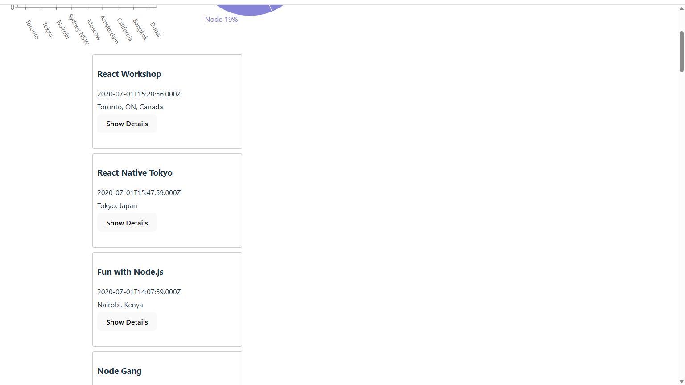

# Meet App - Event Discovery PWA
App hosted by Vercel [click here to view live app](https://meet-lac-one.vercel.app)
## Table of Contents

- [Project Overview](#project-overview)
- [Context and Motivation](#context-and-motivation)
- [5 Ws of the Project](#5-ws-of-the-project)
- [Screenshots](#screenshots)
- [Key Features](#key-features)
  - [Filter Events by City](#1-filter-events-by-city)
  - [Show/Hide Event Details](#2-showhide-event-details)
  - [Specify Number of Events](#3-specify-number-of-events)
  - [Use the App When Offline](#4-use-the-app-when-offline)
  - [Add an App Shortcut to the Home Screen](#5-add-an-app-shortcut-to-the-home-screen)
  - [Display Charts Visualizing Event Details](#6-display-charts-visualizing-event-details)
- [Technical Benefits](#technical-benefits)
- [Technologies Used](#technologies-used)
- [Core Concepts & Logic Flow](#core-concepts--logic-flow)
- [Getting Started](#getting-started)
- [Project Structure](#project-structure-typical)
- [Example Event Object](#example-event-object-from-mock-datajs)
- [Testing Strategy](#testing-strategy)
- [Contribution](#contribution)
- [License](#-license)

## Project Overview

Meet App is a progressive web application designed to help users discover and explore events in various cities. Built using modern web development techniques, the app combines serverless architecture, progressive web app (PWA) capabilities, and test-driven development to provide a robust and user-friendly experience.

## Context and Motivation

Serverless and Progressive Web Apps (PWAs) represent the future of web development, offering numerous advantages:

### Serverless Benefits
- No backend maintenance
- Easy to scale
- Always available
- No cost for idle time

### Progressive Web App (PWA) Advantages
- Instant loading
- Offline support
- Push notifications
- "Add to home screen" prompt
- Responsive design
- Cross-platform compatibility

## 5 Ws of the Project

1. **Who:** Users of the Meet app, including friends, professional network, and potential employers
2. **What:** A progressive web app with offline capabilities and a serverless backend
3. **When:** Anytime users want to view upcoming events in specific cities
4. **Where:** Hosted online with serverless functions (e.g., AWS), accessible across devices
5. **Why:** Demonstrate cutting-edge web development skills, including serverless architecture, PWA, TDD, and data visualization

## Screenshots




## Key Features

### 1. Filter Events by City
**User Stories:**
- As an event attendee, I should be able to filter events by city, so that I can see events in my preferred location.

**Scenarios:**
```gherkin
Feature: Filter Events by City
  Scenario: When user hasn’t searched for a city, show upcoming events from all cities
    Given I am on the events page
    When the user opens the app
    Then I should see upcoming events from all cities

  Scenario: User should see a list of suggestions when they search for a city
    Given the user is on the main page
    When the user starts typing in the city search box
    Then the user should see a list of suggested cities that match what they've typed

  Scenario: User can select a city from the suggested list
    Given the user was typing in the city search box
    And the list of suggested cities is displayed
    When the user selects a city from the list
    Then their city should be changed to that city
    And the user should receive a list of upcoming events in that city
```

### 2. Show/Hide Event Details
**User Stories:**
- As an event attendee, I should be able to see event elements in a collapsed state by default, so that I can browse many events quickly without being overwhelmed by details.
- As an event attendee, I should be able to expand an event to see its details, so that I can learn more about events I'm interested in.
- As an event attendee, I should be able to collapse an event to hide details, so that I can minimize screen clutter after viewing details.

**Scenarios:**
```gherkin
Feature: Show/Hide Event Details
  Scenario: An event element is collapsed by default
    Given the user is viewing the events list
    When the events are loaded
    Then all event details should be hidden
    And only event titles should be visible

  Scenario: User can expand an event to see details
    Given the user is viewing the events list
    And an event is collapsed
    When the user clicks on "show details" button for an event
    Then the event details should be displayed

  Scenario: User can collapse an event to hide details
    Given the user is viewing the events list
    And an event is expanded showing its details
    When the user clicks on "hide details" button for the event
    Then the event details should be hidden
```

### 3. Specify Number of Events
**User Stories:**
- As an event attendee, I should be able to see a default of 32 events when I haven't specified otherwise, so that I have a manageable number of events to browse initially.
- As an event attendee, I should be able to change the number of events displayed, so that I can customize how many events I see based on my preferences.

**Scenarios:**
```gherkin
Feature: Specify Number of Events
  Scenario: When user hasn't specified a number, 32 events are shown by default
    Given the user hasn't changed any event settings
    When the user opens the events list
    Then 32 events should be displayed by default

  Scenario: User can change the number of events displayed
    Given the user is viewing the events list
    When the user selects to show a different number of events
    Then the specified number of events should be displayed
```

### 4. Use the App When Offline
**User Stories:**
- As an event attendee, I should be able to view cached event data when I have no internet connection, so that I can access event information regardless of connectivity.
- As an event attendee, I should see an error message when trying to change search settings offline, so that I understand why certain features aren't available without internet.

**Scenarios:**
```gherkin
Feature: Use the App When Offline
  Scenario: Show cached data when there's no internet connection
    Given the user has previously loaded the app with an internet connection
    When the user opens the app without an internet connection
    Then the app should display cached event data

  Scenario: Show error when user changes search settings
    Given the user has no internet connection
    When the user attempts to change search settings
    Then an error message should be displayed
```

### 5. Add an App Shortcut to the Home Screen
**User Stories:**
- As an event attendee, I should be able to install the app as a shortcut on my device home screen, so that I can access it quickly without opening the browser.

**Scenarios:**
```gherkin
Feature: Add an App Shortcut to the Home Screen
  Scenario: User can install the meet app as a shortcut
    Given the user has opened the app in a browser that supports PWA installation
    When the user selects the option to add the app to home screen
    Then the app should be installed as a shortcut on the device home screen
```

### 6. Display Charts Visualizing Event Details
**User Stories:**
- As an event attendee, I should be able to view a chart showing the number of upcoming events in each city, so that I can understand event distribution.
- As an event attendee, I should be able to see a chart showing the popularity of different event genres, so that I can understand which types of events are most common.

**Scenarios:**
```gherkin
Feature: Display Charts Visualizing Event Details
  Scenario: Show a chart with the number of upcoming events in each city
    Given the user is on the statistics page
    When the page loads
    Then a chart showing the number of upcoming events in each city should be displayed

  Scenario: Show a chart with the popularity of event genres
    Given the user is on the statistics page
    When the page loads
    Then a pie chart showing the distribution of event genres should be displayed
```

## Technical Benefits

- **Serverless Architecture:** Efficient, scalable, and cost-effective backend
- **Progressive Web App:** Enhanced user experience and performance
- **Test-Driven Development:** High-quality, well-tested code
- **Data Visualization:** Intuitive understanding of event statistics

---

## Technologies Used

- **JavaScript (92.9%)** – Main application logic and all React components.
- **HTML (3.4%)** – App structure and markup.
- **CSS (2.2%)** – Styling, layout, and responsive design.
- **Gherkin (1.5%)** – BDD, specifying application features and scenarios.
- **React** – (Inferred) For building the UI as a single-page application.
- **Workbox** – For service worker and caching strategies.
- **Serverless Functions** – For backend API integration (e.g., AWS Lambda).
- **Jest/Testing Library** – (Inferred) For unit and integration tests.
- **Charting Library** – (Inferred, e.g., Recharts, Chart.js) For data visualization.
- **Google Calendar API** – As the source of event data.

---

## Core Concepts & Logic Flow

### 1. **Architecture Overview**
- **Frontend:** Built with JavaScript (React is likely, given PWA and component structure), HTML, and CSS.
- **Backend:** Serverless functions (e.g., AWS Lambda or similar) for all API interactions—no traditional server to maintain.
- **Testing:** Gherkin for Behavior Driven Development (BDD), unit/integration tests for core logic.

### 2. **Code/Logic Flow**
- **Event Fetching:** 
  - App loads and fetches events via serverless API (e.g., Google Calendar API, proxied through serverless function).
  - Data is filtered and presented to the user in city-based lists.
- **Offline Support:** 
  - Service Worker (using Workbox) caches assets and API responses for offline usage.
  - User can still browse previously loaded events offline.
- **Event Details:** 
  - Users can expand event items to see details such as description, organizer, start/end time, and location.
- **Visualization:** 
  - Data visualizations (charts, graphs) give insight into event trends over time or by location.
- **Testing:** 
  - Gherkin feature files describe user stories and acceptance criteria.
  - Tests ensure all components, logic, and user flows work as expected.

---

## Getting Started

1. **Install dependencies:**
   ```bash
   npm install
   ```
2. **Run the app locally:**
   ```bash
   npm run dev
   ```
3. **Run tests:**
    for the End-to-end test to pass, app needs to be running locally. A  separate testing environment is needed than the unit tests, therefore run:

   ```bash
   npm run test:e2e
   ```

   for the other (unit/component) tests, run: 

   ```bash
    npm run test:unit
   ``` 

   to test all tests at once:

   ```bash
   npm run test:all
   ```

4. **Build for production:**
   ```bash
   npm run build
   ```

---

## Project Structure (Typical)
```
/public              # Static assets
/src
  /components        # React components
  /services          # Serverless API integration
  /utils             # Utilities and helpers
  /tests             # Unit/integration tests
  mock-data.js       # Sample event data
  service-worker.js  # PWA offline logic
README.md
package.json
```

---

## Example Event Object (from `mock-data.js`)
```json
{
  "summary": "React is Fun",
  "description": "Learn React and build awesome UIs...",
  "location": "Santiago, Chile",
  "start": { "dateTime": "2020-06-29T01:00:00+02:00" },
  "end": { "dateTime": "2020-06-29T02:00:00+02:00" },
  "organizer": { "email": "fullstackwebdev@careerfoundry.com" }
}
```

---

## Testing Strategy

This project implements a comprehensive testing strategy using **Test-Driven Development (TDD)** and **Behavior-Driven Development (BDD)** approaches to ensure code quality, reliability, and user experience.

### Testing Architecture

The testing is organized into two main directories:

#### `__tests__/` - Unit and Integration Tests
Contains Jest-based unit and integration tests for React components and application logic:

- **`App.test.js`** - Main application component tests, including rendering and integration with other components
- **`CitySearch.test.js`** - City search functionality, autocomplete suggestions, and city selection
- **`Event.test.js`** - Individual event component rendering, event details display and interactions  
- **`EventList.test.js`** - Event list rendering, filtering, and event count management
- **`NumberOfEvents.test.js`** - Number of events selector component and input validation
- **`EndToEnd.test.js`** - End-to-end testing using Puppeteer for complete user workflows

#### `src/features/` - BDD Feature Tests
Contains Gherkin feature files and corresponding step definitions following BDD methodology:

**Feature Files (.feature):**
- **`filterEventsByCity.feature`** - User stories for city-based event filtering
- **`showHideEventDetails.feature`** - Event detail expansion/collapse behaviors  
- **`specifyNumberOfEvents.feature`** - Number of events selection scenarios

**Step Definition Files (.test.js):**
- **`filterEventsByCity.test.js`** - Jest-Cucumber step implementations for city filtering
- **`showHideEventDetails.test.js`** - Step definitions for event detail interactions
- **`specifyNumberOfEvents.test.js`** - Step implementations for event count selection

### Testing Technologies

#### Core Testing Framework
- **Jest** - Primary testing framework for unit/integration tests
- **React Testing Library** - Component testing utilities with focus on user interactions
- **Jest-DOM** - Additional Jest matchers for DOM element assertions

#### BDD Implementation  
- **Jest-Cucumber** - Bridges Gherkin feature files with Jest test execution
- **Gherkin Syntax** - Natural language test scenarios following Given-When-Then structure

#### End-to-End Testing
- **Puppeteer** - Headless Chrome automation for complete user journey testing
- **Node Environment** - Separate test environment for E2E tests to avoid conflicts

### Gherkin BDD Approach

The project uses **Gherkin** syntax to write human-readable test scenarios that serve as:
- **Living Documentation** - Features described in plain English
- **Acceptance Criteria** - Clear definition of "done" for each feature
- **Communication Tool** - Bridge between technical and non-technical stakeholders

**Example Gherkin Scenario:**
```gherkin
Feature: Filter Events by City
  Scenario: User can select a city from the suggested list
    Given the user was typing in the city search box
    And the list of suggested cities is displayed
    When the user selects a city from the list
    Then their city should be changed to that city
    And the user should receive a list of upcoming events in that city
```

### Test Execution

The project provides separate test commands for different testing needs:

```bash
# Run unit/component tests only (excludes E2E)
npm run test:unit

# Run end-to-end tests only (requires running dev server)
npm run test:e2e  

# Run all tests sequentially
npm run test:all

# Watch mode for development
npm test -- --watch
```

### Test Environment Separation

**Unit/Integration Tests:**
- Environment: `jest-environment-jsdom`
- Fast execution, mocked dependencies
- Focus on component logic and user interactions

**End-to-End Tests:**
- Environment: `jest-environment-node`  
- Real browser automation with Puppeteer
- Tests complete user workflows on running application

**BDD Feature Tests:**
- Integrated with Jest using jest-cucumber
- Combines Gherkin scenarios with Jest assertions
- Validates user stories against actual component behavior

### Testing Benefits

- **Quality Assurance** - Comprehensive test coverage ensures reliable functionality
- **Documentation** - BDD scenarios serve as executable specifications
- **User-Centric** - Testing focuses on actual user behaviors and expectations

---

## Contribution

Pull requests are welcome! Please ensure code is well-tested and aligns with project structure and standards.

---

## 📄 License

This project is licensed under the MIT License.
--- 
